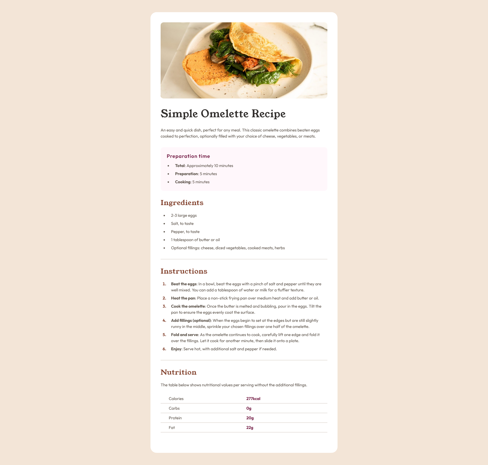

# Frontend Mentor - Recipe page solution

This is a solution to the [Recipe page challenge on Frontend Mentor](https://www.frontendmentor.io/challenges/recipe-page-KiTsR8QQKm). Frontend Mentor challenges help you improve your coding skills by building realistic projects.

## Table of contents

-   [Overview](#overview)
    -   [The challenge](#the-challenge)
    -   [Screenshot](#screenshot)
    -   [Links](#links)
-   [My process](#my-process)

    -   [Built with](#built-with)

-   [Author](#author)

## Overview

### Screenshot

### Links

-   Solution URL: [Add solution URL here](https://your-solution-url.com)
-   Live Site URL: [github-pages](https://jojo25011990.github.io/recipe-page/)

## My process

### Built with

-   Semantic HTML5 markup
-   SCSS (BEM)
-   Flexbox
-   Desktop-first workflow

## Author

-   Frontend Mentor - [Jojo25011990](https://www.frontendmentor.io/profile/Jojo25011990)
-   Instagram - [web.animations.and.effects](https://www.instagram.com/web.animations.and.effects/)
